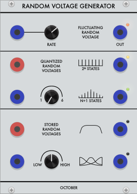
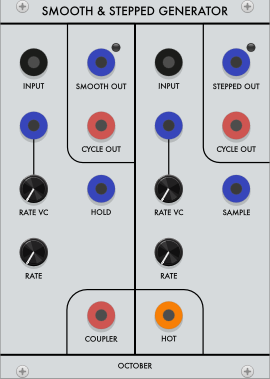
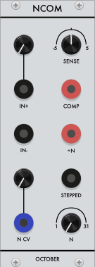

# October modules
#### A VCV Rack plugin

This plugin provides several modules for the [VCV Rack](https://vcvrack.com/) application.

My goal here is to reproduce vaguely faithful renditions of classic Serge and Buchla modules,
with an eye to ergonomics as well as functionality.

In general, I want these modules to behave as much like the originals as possible,
so if you encounter a situation where they don't, please create an Issue.
Much of the impetus for this project was not having access to my physical synthesizers,
so it's often hard for me to know I'm getting things right.
Even things like the range of a particular knob would be nice to know.

---

- [Random Voltage Generator](#random-voltage-generator)
- [SSG](#ssg)
- [NCOM](#ncom)

### Random Voltage Generator

This module is an adaptation of the [Buchla 266](https://buchla.com/product/266/) Source of Uncertainty.
The main "Fluctuating", "Quantized", and "Stored" sections should work mostly identically to the original.

The Fluctuating Random Voltages section provides a meandering, continuous voltage that moves up and down smoothly,
in a somewhat more controlled way than just a random stream.

Quantized Random Voltages provides two sets of random voltages, jumping on trigger input.
You can think of it as having two streams of random voltages internally (actually repeating 64-step sequences like the original)
that is being quantized to two different scales. The `n` knob sets `n` from `1` to `6`, which is interpreted by the two outputs.

The `2ⁿ` output quantizes to a scale with `2ⁿ` notes, evenly distributed over the 0V-10V output range.
That means that for `n = 1`, the scale only contains 2 notes, at 0V and 10V.
(I say "notes" here, but it's all just floating point numbers representing voltages)
Its random sequence is also chosen with a uniform distribution over that range, meaning that any voltage is just as likely as another.

The `n+1` does much the same thing, but quantizing to a scale of only `n+1` notes.
And while the notes that each random voltage might be quantized to are spread out over the output range evenly,
the random numbers that are BEING quantized are chosen with a 'normal' distribution (ie bell curve) with a mean of 5V.

One fun thing to note is that while the next note in each sequence is only chosen when a trigger is sent,
the existing voltages are re-quantized whenever you change `n` (via the knob or CV).

#### Issues

- I chose to emit the noise section. There are plenty of noise modules for VCV.
- I haven't implemented the integrator section, and probably won't. It's just a slew.
- I haven't yet implemented the sample & hold. The 266's S&H is a little funky, so I would like to eventually, but I'm mostly just not sure where to put it on the panel.

### SSG

The [Smooth & Stepped Generator (SSG)](https://sdiy.info/wiki/CGS_Serge_smooth_and_stepped_generator)
is essentially two slew generators, one run thew a sample & hold, and both run into a comparator.
It is possibly the most quintissential module of the Serge ecosystem, capable of performing a huge number of different functions
via various self-patching configurations.

Detailing its functionality is beyond the scope of this document.
[Serge Wizardry](https://serge-fans.com/wiz_SSG1.htm) is probably a good place to get an idea of its many possibilities.

#### Issues

- I made this one first, so I've already forgotten. I remember the range being kind of a guess, so that might not be quite like the hardware version.
- I think self-oscillation might not work. I would like it to.

### NCOM

The Divide By N & Comparator ([NCOM](https://serge-modular.com/serge_eurorack?mod=RS_NCOM_E)) is a comparator module with its output sent through a [Schmitt trigger](https://en.wikipedia.org/wiki/Schmitt_trigger) followed by a clock divider.

When `positive input + sense parameter > negative input`, the comparator output is set high (10V), and otherwise it is low (0V).
Going high will trigger a pulse that is divided by `n`, so the `÷n` output will emit one pulse for every `n` pulses from the comparator.

#### Issues

- The NCOM currently doesn't self-oscillate when the comp out is fed back in, but it should.

### Credits

There are no new ideas under the sun, especially from me.
These are just crude imitations of designs by Don Buchla, Serge Tcherepnin, Ken Stone, and probably others.
Panel graphics and banana jacks are original, by me, but the panel aesthetic is straight up theft from [Loudest Warning](http://www.loudestwarning.co.uk/)

### License

Code is released under the [GPL 3.0](LICENSE.txt).
Assets and graphics are licensed [CC BY-NC-SA](https://creativecommons.org/licenses/by-nc-sa/4.0/)
